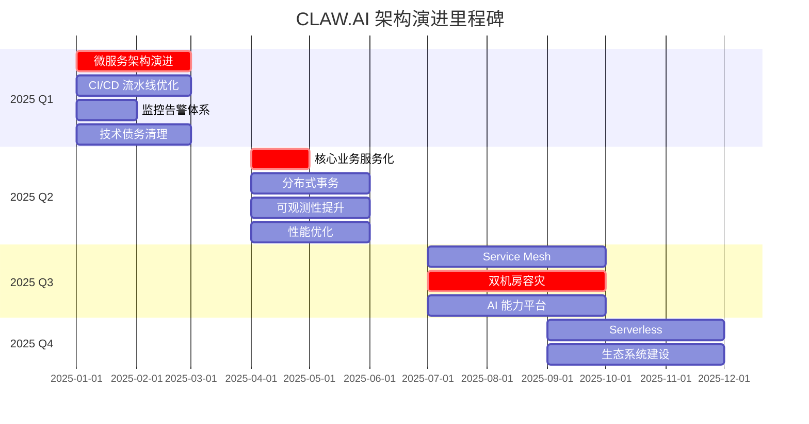

# CLAW.AI 架构演进路线图

## 1. 概述

本文档定义了 CLAW.AI 项目的架构演进路线图，包括短期、中期和长期规划，确保架构持续演进以支撑业务发展。

## 2. 当前架构状态（2025 Q1）

### 2.1 架构现状

```
当前架构: 单体应用 + 部分微服务

技术栈:
- 前端: Vue 3 + Element Plus
- 后端: Spring Boot 3 + MySQL 8 + Redis 7
- 部署: Docker + K8s (部分服务)
- 监控: Prometheus + Grafana (基础)
```

### 2.2 当前痛点

- **扩展性**: 单体应用难以水平扩展
- **部署效率**: 部署流程繁琐，耗时长
- **监控告警**: 监控体系不完善，告警不及时
- **技术债务**: 存在一定技术债务需要清理
- **文档缺失**: 部分架构文档不完善

### 2.3 架构优势

- **简单性**: 架构简单，易于理解
- **开发效率**: 小团队开发效率较高
- **成本**: 基础设施成本可控
- **稳定性**: 系统运行稳定

## 3. 短期规划（1-3 个月，2025 Q1）

### 3.1 目标

- 完善基础架构体系
- 提升开发和部署效率
- 建立完整的监控告警体系
- 清理关键技术债务

### 3.2 关键项目

#### 项目 1: 微服务架构演进

| 任务 | 开始时间 | 结束时间 | 负责人 | 优先级 |
|------|----------|----------|--------|--------|
| 服务拆分设计 | 2025-01 | 2025-01 | 架构师团队 | P0 |
| 用户服务独立 | 2025-01 | 2025-02 | 后端团队 | P0 |
| 订单服务独立 | 2025-02 | 2025-03 | 后端团队 | P0 |
| API Gateway 搭建 | 2025-01 | 2025-02 | 后端团队 | P0 |
| 服务注册中心 | 2025-01 | 2025-01 | 运维团队 | P0 |

**预期成果**:
- 用户服务、订单服务独立部署
- API Gateway 统一入口
- 服务注册中心（Nacos/Consul）

#### 项目 2: CI/CD 流水线优化

| 任务 | 开始时间 | 结束时间 | 负责人 | 优先级 |
|------|----------|----------|--------|--------|
| GitLab CI 流水线搭建 | 2025-01 | 2025-01 | 运维团队 | P1 |
| 自动化测试集成 | 2025-01 | 2025-02 | 测试团队 | P1 |
| 自动化部署脚本 | 2025-01 | 2025-02 | 运维团队 | P1 |
| 灰度发布流程 | 2025-02 | 2025-03 | 运维团队 | P1 |

**预期成果**:
- 代码提交自动触发 CI/CD
- 自动化测试覆盖率 > 70%
- 部署时间从 1 小时缩短到 10 分钟

#### 项目 3: 监控告警体系完善

| 任务 | 开始时间 | 结束时间 | 负责人 | 优先级 |
|------|----------|----------|--------|--------|
| 监控指标梳理 | 2025-01 | 2025-01 | 监控负责人 | P0 |
| 告警规则配置 | 2025-01 | 2025-02 | 监控负责人 | P0 |
| 监控大盘建设 | 2025-01 | 2025-02 | 监控负责人 | P1 |
| 日志系统优化 | 2025-01 | 2025-02 | 运维团队 | P1 |

**预期成果**:
- 核心指标 100% 监控
- 告警响应时间 < 15 分钟
- 日志查询时间 < 5 秒

#### 项目 4: 技术债务清理

| 任务 | 开始时间 | 结束时间 | 负责人 | 优先级 |
|------|----------|----------|--------|--------|
| P0 技术债务清理 | 2025-01 | 2025-01 | 各团队 | P0 |
| P1 技术债务评估 | 2025-01 | 2025-01 | 架构师团队 | P1 |
| P1 技术债务清理 | 2025-01 | 2025-03 | 各团队 | P1 |

**预期成果**:
- P0 技术债务全部清零
- P1 技术债务减少 50%
- 技术债务管理机制建立

### 3.3 风险和应对

| 风险 | 影响 | 应对措施 |
|------|------|----------|
| 微服务拆分风险高 | 高 | 采用渐进式拆分，保持回滚能力 |
| 迁移期间稳定性 | 中 | 充分测试，灰度发布 |
| 资源不足 | 中 | 优先保证核心项目，可延期非关键项目 |

### 3.4 成功标准

- [ ] 用户服务、订单服务独立部署
- [ ] CI/CD 流水线上线
- [ ] 核心监控指标覆盖
- [ ] P0 技术债务清零
- [ ] 架构文档完善

## 4. 中期规划（3-6 个月，2025 Q2）

### 4.1 目标

- 完成核心业务服务化
- 建立分布式事务体系
- 提升系统可观测性
- 性能优化

### 4.2 关键项目

#### 项目 1: 核心业务服务化

| 任务 | 开始时间 | 结束时间 | 负责人 | 优先级 |
|------|----------|----------|--------|--------|
| 支付服务独立 | 2025-04 | 2025-04 | 后端团队 | P0 |
| 商品服务独立 | 2025-04 | 2025-05 | 后端团队 | P1 |
| 库存服务独立 | 2025-04 | 2025-05 | 后端团队 | P1 |
| 通知服务独立 | 2025-05 | 2025-05 | 后端团队 | P2 |

**预期成果**:
- 核心业务全部服务化
- 服务间通信标准化

#### 项目 2: 分布式事务方案

| 任务 | 开始时间 | 结束时间 | 负责人 | 优先级 |
|------|----------|----------|--------|--------|
| 分布式事务选型 | 2025-04 | 2025-04 | 架构师团队 | P0 |
| Seata 框架集成 | 2025-04 | 2025-05 | 后端团队 | P0 |
| 分布式事务测试 | 2025-05 | 2025-05 | 测试团队 | P0 |
| 分布式事务上线 | 2025-06 | 2025-06 | 运维团队 | P0 |

**预期成果**:
- 分布式事务方案落地
- 事务一致性问题解决

#### 项目 3: 可观测性提升

| 任务 | 开始时间 | 结束时间 | 负责人 | 优先级 |
|------|----------|----------|--------|--------|
| 链路追踪集成 | 2025-04 | 2025-04 | 后端团队 | P1 |
| 性能监控优化 | 2025-04 | 2025-05 | 监控负责人 | P1 |
| 业务指标监控 | 2025-05 | 2025-06 | 监控负责人 | P1 |

**预期成果**:
- 链路追踪覆盖率 > 90%
- 性能瓶颈可定位
- 业务指标实时监控

#### 项目 4: 性能优化

| 任务 | 开始时间 | 结束时间 | 负责人 | 优先级 |
|------|----------|----------|--------|--------|
| 数据库优化 | 2025-04 | 2025-05 | DBA | P1 |
| 缓存优化 | 2025-04 | 2025-05 | 后端团队 | P1 |
| 接口优化 | 2025-05 | 2025-06 | 后端团队 | P1 |
| 性能测试 | 2025-06 | 2025-06 | 测试团队 | P0 |

**预期成果**:
- 响应时间 P95 < 500ms
- 吞吐量提升 50%
- 数据库连接优化

### 4.3 风险和应对

| 风险 | 影响 | 应对措施 |
|------|------|----------|
| 分布式事务复杂度 | 高 | 充分调研，POC 验证 |
| 性能优化效果 | 中 | 基准测试，数据驱动 |
| 服务拆分粒度 | 中 | 合理评估，避免过度拆分 |

### 4.4 成功标准

- [ ] 核心业务全部服务化
- [ ] 分布式事务方案上线
- [ ] 链路追踪覆盖核心链路
- [ ] 性能指标达到预期
- [ ] P1 技术债务减少 80%

## 5. 长期规划（6-12 个月，2025 H2）

### 5.1 目标

- 构建云原生架构
- 建立多机房容灾体系
- 引入 AI 能力
- 生态系统建设

### 5.2 关键项目

#### 项目 1: 云原生架构

| 任务 | 开始时间 | 结束时间 | 负责人 | 优先级 |
|------|----------|----------|--------|--------|
| Service Mesh 调研 | 2025-07 | 2025-07 | 架构师团队 | P1 |
| Service Mesh POC | 2025-07 | 2025-08 | 架构师团队 | P1 |
| Service Mesh 落地 | 2025-08 | 2025-10 | 运维团队 | P1 |
| Serverless 探索 | 2025-09 | 2025-12 | 架构师团队 | P2 |

**预期成果**:
- Service Mesh 方案落地
- 服务治理能力提升
- 探索 Serverless 场景

#### 项目 2: 多机房容灾

| 任务 | 开始时间 | 结束时间 | 负责人 | 优先级 |
|------|----------|----------|--------|--------|
| 容灾方案设计 | 2025-07 | 2025-08 | 架构师团队 | P0 |
| 双机房部署 | 2025-08 | 2025-09 | 运维团队 | P0 |
| 数据同步方案 | 2025-08 | 2025-10 | DBA | P0 |
| 容灾演练 | 2025-10 | 2025-10 | 运维团队 | P0 |

**预期成果**:
- 双机房容灾能力
- RPO < 1 分钟，RTO < 5 分钟
- 定期容灾演练

#### 项目 3: AI 能力建设

| 任务 | 开始时间 | 结束时间 | 负责人 | 优先级 |
|------|----------|----------|--------|--------|
| AI 能力规划 | 2025-07 | 2025-08 | AI 团队 | P0 |
| 模型服务平台 | 2025-08 | 2025-10 | AI 团队 | P0 |
| 智能推荐系统 | 2025-09 | 2025-11 | AI 团队 | P1 |
| AI 能力集成 | 2025-10 | 2025-12 | 各团队 | P1 |

**预期成果**:
- AI 能力平台上线
- 智能推荐功能
- AI 能力服务化

#### 项目 4: 生态系统

| 任务 | 开始时间 | 结束时间 | 负责人 | 优先级 |
|------|----------|----------|--------|--------|
| 开放 API 平台 | 2025-07 | 2025-09 | 平台团队 | P1 |
| 开发者文档 | 2025-08 | 2025-10 | 文档团队 | P1 |
| 第三方集成 | 2025-09 | 2025-12 | 平台团队 | P2 |

**预期成果**:
- 开放 API 平台
- 开发者生态
- 第三方集成能力

### 5.3 风险和应对

| 风险 | 影响 | 应对措施 |
|------|------|----------|
| 云原生技术复杂 | 高 | 充分调研，逐步推进 |
| 多机房成本 | 中 | 成本收益评估，合理规划 |
| AI 能力不确定性 | 高 | 快速迭代，小步验证 |

### 5.4 成功标准

- [ ] 云原生架构落地
- [ ] 双机房容灾能力
- [ ] AI 能力上线
- [ ] 开放 API 平台
- [ ] P2 技术债务清理完成

## 6. 架构演进里程碑



## 7. 架构愿景（2026+）

### 7.1 终极架构

```
CLAW.AI 终极架构:

┌─────────────────────────────────────────────────────┐
│                     客户层                          │
│  Web  |  Mobile  |  Mini Program  |  Open API      │
└─────────────────────────────────────────────────────┘
                          ↓
┌─────────────────────────────────────────────────────┐
│                  全球接入层                          │
│         CDN  |  WAF  |  Global LB                  │
└─────────────────────────────────────────────────────┘
                          ↓
┌─────────────────────────────────────────────────────┐
│               Service Mesh 层                       │
│         Istio  |  Envoy  |  可观测性                │
└─────────────────────────────────────────────────────┘
                          ↓
┌─────────────────────────────────────────────────────┐
│                   微服务层                          │
│  业务服务  |  AI 服务  |  平台服务  |  支撑服务     │
└─────────────────────────────────────────────────────┘
                          ↓
┌─────────────────────────────────────────────────────┐
│                   数据层                            │
│  关系型数据库  |  NoSQL  |  数据湖  |  向量数据库   │
└─────────────────────────────────────────────────────┘
                          ↓
┌─────────────────────────────────────────────────────┐
│                 基础设施层                          │
│  Kubernetes  |  Serverless  |  多云管理            │
└─────────────────────────────────────────────────────┘
```

### 7.2 核心能力

- **全球分布式部署**: 支持全球多机房、多地域
- **Serverless 能力**: 无服务器架构
- **AI Native**: AI 能力深度集成
- **开放生态**: 完善的开放平台
- **智能运维**: AIOps、自愈能力

### 7.3 技术方向

- **云原生**: 全面拥抱云原生
- **AI First**: AI 能力优先
- **边缘计算**: 边缘节点部署
- **数据智能**: 实时数据分析

## 8. 资源规划

### 8.1 人力资源

| 角色 | Q1 | Q2 | Q3 | Q4 |
|------|----|----|----|----|
| 架构师 | 2 | 2 | 3 | 3 |
| 后端开发 | 6 | 8 | 10 | 12 |
| 前端开发 | 3 | 4 | 5 | 6 |
| 运维工程师 | 2 | 3 | 4 | 5 |
| 测试工程师 | 2 | 3 | 3 | 4 |
| AI 工程师 | 0 | 0 | 2 | 3 |

### 8.2 基础设施

| 资源 | Q1 | Q2 | Q3 | Q4 |
|------|----|----|----|----|
| 服务器 | 20 | 30 | 50 | 80 |
| 数据库 | 3 | 5 | 8 | 12 |
| 存储空间 | 10TB | 20TB | 50TB | 100TB |
| 带宽 | 100Mbps | 200Mbps | 500Mbps | 1Gbps |

### 8.3 预算规划

| 类别 | Q1 | Q2 | Q3 | Q4 | 合计 |
|------|----|----|----|----|------|
| 基础设施 | ¥50万 | ¥80万 | ¥120万 | ¥150万 | ¥400万 |
| 人力成本 | ¥200万 | ¥250万 | ¥350万 | ¥450万 | ¥1250万 |
| 第三方服务 | ¥20万 | ¥30万 | ¥50万 | ¥80万 | ¥180万 |
| **合计** | **¥270万** | **¥360万** | **¥520万** | **¥680万** | **¥1830万** |

## 9. 沟通和汇报

### 9.1 月度汇报

- 架构进展
- 项目状态
- 风险和问题
- 下月计划

### 9.2 季度评审

- 季度总结
- 架构评估
- 下季度规划
- 资源调整

### 9.3 年度规划

- 年度总结
- 架构演进回顾
- 下年度规划
- 长期愿景

## 10. 依赖关系

| 项目 | 依赖项目 | 说明 |
|------|----------|------|
| 核心业务服务化 | 微服务架构演进 | 需要先完成服务拆分 |
| 分布式事务 | 核心业务服务化 | 服务化后才能引入分布式事务 |
| Service Mesh | 核心业务服务化 | 服务规模达到一定程度 |
| 双机房容灾 | 微服务架构演进 | 需要微服务基础 |

## 11. 变更管理

### 11.1 变更流程

1. 识别需要变更的内容
2. 评估变更影响
3. 提交变更请求
4. 架构师评审
5. CTO 审批
6. 更新路线图
7. 通知相关团队

### 11.2 变更记录

| 日期 | 变更内容 | 原因 | 影响范围 | 批准人 |
|------|----------|------|----------|--------|
| ... | ... | ... | ... | ... |

## 12. 附录

### 12.1 相关文档

- [系统架构总览](../claw-ai-backend/docs/ARCHITECTURE_DOCUMENTATION.md)
- [技术决策记录](../claw-ai-backend/docs/ADR_TEMPLATE.md)
- [技术债务管理](../claw-ai-backend/docs/TECHNICAL_DEBT.md)

### 12.2 参考资料

- [云原生架构白皮书](链接)
- [微服务架构最佳实践](链接)
- [分布式事务方案对比](链接)

---

**文档版本**：v1.0
**创建日期**：2025-01
**维护人**：架构师团队
**更新频率**：季度
**下次评审**：2025-04
