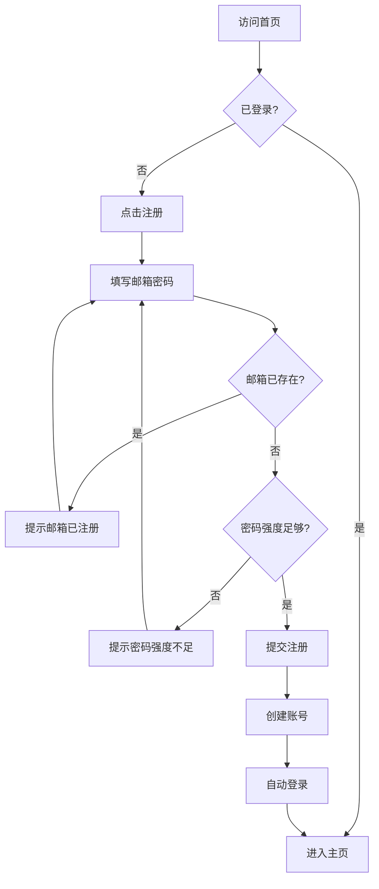
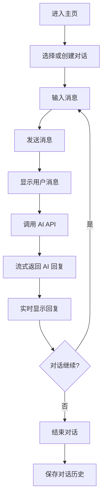
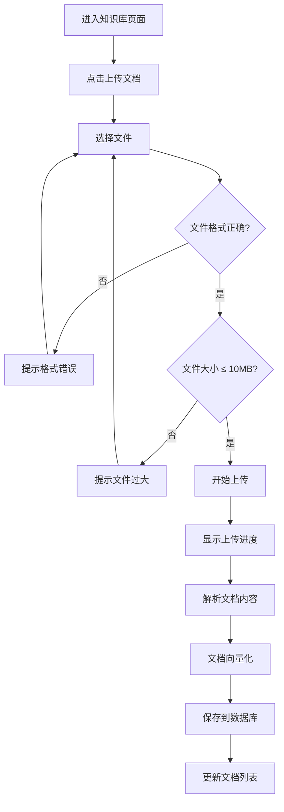
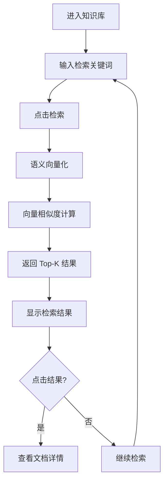
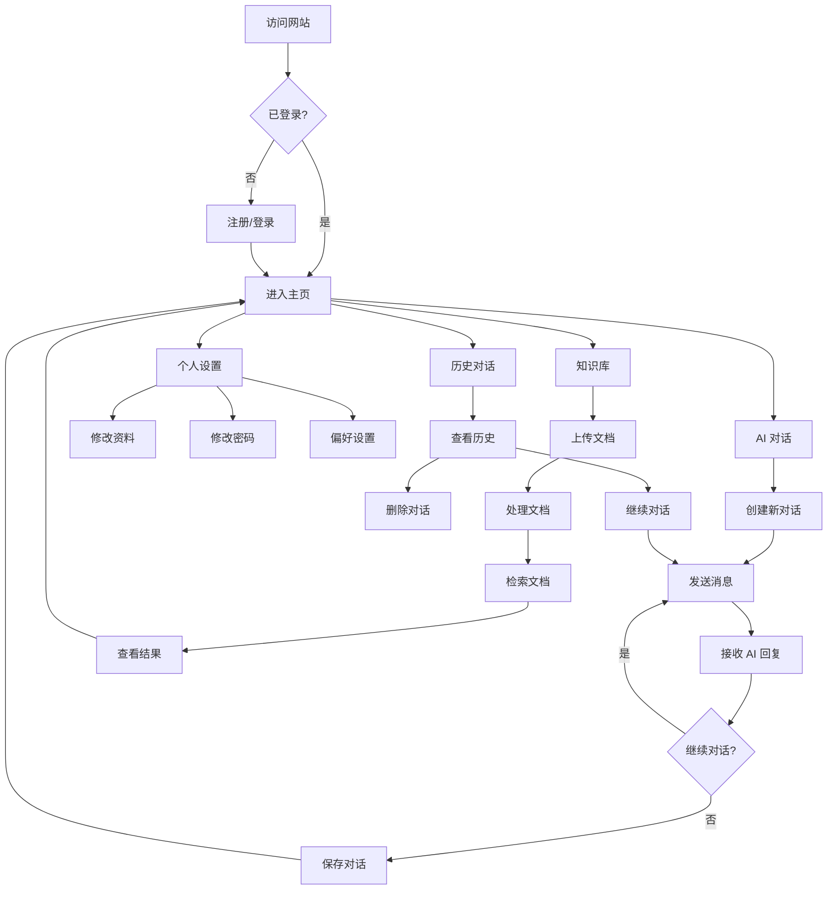
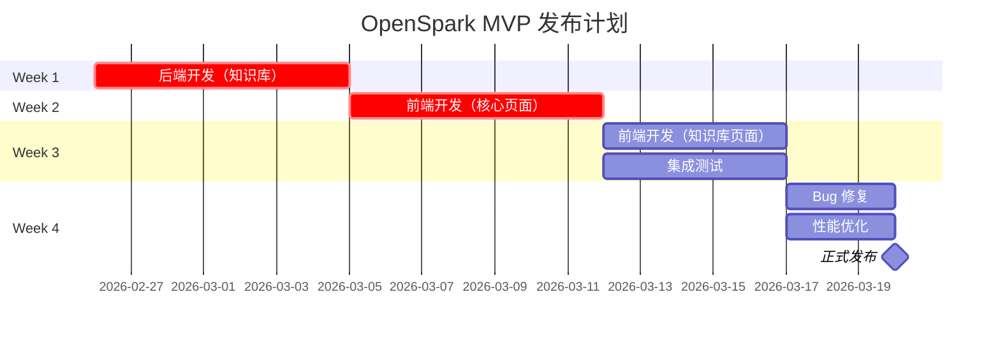

# OpenSpark MVP 产品需求文档 (PRD)

**产品名称：** OpenSpark - AI 智能助手平台  
**版本：** v1.0 MVP  
**文档状态：** Draft  
**创建日期：** 2026-02-26  
**负责人：** 产品经理  
**最后更新：** 2026-02-26  

---

## 📋 文档目录

1. [产品概述](#1-产品概述)
2. [功能需求](#2-功能需求)
3. [用户流程设计](#3-用户流程设计)
4. [API 接口规范](#4-api-接口规范)
5. [验收标准](#5-验收标准)
6. [测试用例](#6-测试用例)
7. [非功能性需求](#7-非功能性需求)
8. [发布计划](#8-发布计划)

---

## 1. 产品概述

### 1.1 产品愿景

OpenSpark 是一个 AI 智能助手平台，为企业用户提供基于大语言模型的智能对话服务，支持知识库管理和 RAG（检索增强生成）功能。

### 1.2 目标用户

- **主要用户：** 中小企业员工、团队管理者
- **次要用户：** 个人开发者、自由职业者
- **用户画像：**
  - 年龄：25-45 岁
  - 技术水平：中等
  - 需求：提高工作效率、知识管理

### 1.3 核心价值

- **智能对话：** 基于 GLM-4 模型的高质量 AI 对话
- **知识管理：** 支持企业知识库上传和检索
- **成本透明：** Token 消耗实时追踪
- **易于使用：** 简洁直观的用户界面

### 1.4 MVP 目标

**时间范围：** 2-3 周  
**核心目标：** 验证核心功能，获取早期用户反馈

**成功指标：**
- 用户注册转化率 > 30%
- 日活跃用户（DAU）> 100
- 用户留存率（7天）> 40%
- 平均对话轮次 > 5 次/会话

---

## 2. 功能需求

### 2.1 功能优先级矩阵

| 优先级 | 功能模块 | 功能点 | 状态 |
|--------|----------|--------|------|
| **P0** | 用户认证 | 用户注册 | ✅ 后端完成 |
| **P0** | 用户认证 | 用户登录 | ✅ 后端完成 |
| **P0** | AI 对话 | 创建对话 | ✅ 后端完成 |
| **P0** | AI 对话 | 发送消息 | ✅ 后端完成 |
| **P0** | AI 对话 | AI 回复 | ✅ 后端完成 |
| **P0** | 对话管理 | 查看历史 | ✅ 后端完成 |
| **P0** | 对话管理 | 删除对话 | ✅ 后端完成 |
| **P0** | 知识库 | 文档上传 | ❌ 待开发 |
| **P0** | 知识库 | 文档列表 | ❌ 待开发 |
| **P0** | 知识库 | 语义检索 | ❌ 待开发 |
| **P1** | 用户设置 | 个人资料 | ❌ 待开发 |
| **P1** | Token 追踪 | 成本统计 | ❌ 待开发 |
| **P1** | 实时通信 | WebSocket | ✅ 后端完成 |
| **P2** | 用户设置 | 偏好设置 | ❌ 待开发 |
| **P2** | 对话管理 | 对话导出 | ❌ 待开发 |

---

### 2.2 P0 核心功能详细需求

#### 2.2.1 用户注册/登录

**功能描述：**
- 用户通过邮箱注册账号
- 邮箱格式验证
- 密码强度要求（至少 8 位，包含字母和数字）
- 密码加密存储（bcrypt）
- 邮箱验证（可选，MVP 阶段暂不强制）

**用户故事：**
> 作为新用户，我想要注册账号，以便使用平台的 AI 对话功能。

**验收标准：**
- ✅ 用户可以成功注册新账号
- ✅ 邮箱重复时显示错误提示
- ✅ 密码强度不足时显示提示
- ✅ 注册成功后自动登录
- ✅ JWT Token 正确返回

**输入/输出：**
```json
// 输入
{
  "email": "user@example.com",
  "password": "SecurePass123",
  "name": "张三"
}

// 输出
{
  "access_token": "eyJ0eXAiOiJKV1QiLCJhbGc...",
  "refresh_token": "eyJ0eXAiOiJKV1QiLCJhbGc...",
  "token_type": "bearer",
  "user": {
    "id": 1,
    "email": "user@example.com",
    "name": "张三"
  }
}
```

---

#### 2.2.2 AI 聊天对话

**功能描述：**
- 创建新对话会话
- 发送用户消息
- 接收 AI 回复（流式响应）
- 支持 Markdown 格式
- 显示 Token 消耗

**用户故事：**
> 作为用户，我想要与 AI 进行对话，以便获取智能回答和建议。

**验收标准：**
- ✅ 用户可以创建新对话
- ✅ 用户消息可以成功发送
- ✅ AI 回复实时流式显示
- ✅ Markdown 正确渲染
- ✅ Token 消耗正确计算
- ✅ 对话历史正确保存

**技术实现：**
- 使用 WebSocket 实现流式响应
- AI 模型：GLM-4
- 响应时间：< 3 秒首字

**输入/输出：**
```json
// 输入
{
  "conversation_id": 1,
  "content": "请介绍一下人工智能的发展历程"
}

// 输出（流式）
data: {"content": "人工", "tokens": 2}
data: {"content": "智能", "tokens": 2}
data: {"content": "的", "tokens": 1}
data: [DONE]
```

---

#### 2.2.3 对话历史管理

**功能描述：**
- 查看所有历史对话
- 按时间倒序排列
- 对话标题自动生成
- 删除单个对话
- 搜索对话（可选）

**用户故事：**
> 作为用户，我想要查看历史对话，以便回顾之前的交流内容。

**验收标准：**
- ✅ 对话列表正确显示
- ✅ 对话按时间倒序排列
- ✅ 对话标题准确（基于首条消息生成）
- ✅ 可以删除对话
- ✅ 删除后数据不可见

**输入/输出：**
```json
// 输出
{
  "conversations": [
    {
      "id": 1,
      "title": "关于人工智能的讨论",
      "created_at": "2026-02-26T10:00:00Z",
      "message_count": 5
    }
  ],
  "total": 10
}
```

---

#### 2.2.4 知识库文档上传

**功能描述：**
- 支持文件格式：PDF、TXT、Markdown
- 文件大小限制：10MB
- 自动解析文档内容
- 文档向量化处理
- 显示上传进度

**用户故事：**
> 作为用户，我想要上传知识文档，以便构建企业知识库。

**验收标准：**
- ✅ 支持上传 PDF、TXT、MD 文件
- ✅ 文件大小超限时提示错误
- ✅ 上传进度实时显示
- ✅ 文档内容正确解析
- ✅ 向量化成功（向量 ID 返回）
- ✅ 文档列表正确显示

**技术实现：**
- 向量数据库：Qdrant
- Embedding 模型：智谱 Embedding API
- 文档解析：PyPDF2（PDF）、内置（TXT/MD）

**输入/输出：**
```json
// 输入
POST /api/knowledge-bases/{kb_id}/documents
Content-Type: multipart/form-data
file: document.pdf

// 输出
{
  "id": 1,
  "title": "产品手册.pdf",
  "file_type": "pdf",
  "file_size": 2048576,
  "status": "processing",
  "chunk_count": 0
}
```

---

#### 2.2.5 知识库检索

**功能描述：**
- 语义检索相关文档片段
- 支持关键词检索（备选）
- 显示相关性分数
- 检索结果高亮显示

**用户故事：**
> 作为用户，我想要检索知识库，以便快速找到相关信息。

**验收标准：**
- ✅ 语义检索返回相关结果
- ✅ 相关性分数正确计算
- ✅ 检索结果按相关性排序
- ✅ 检索速度 < 1 秒
- ✅ 结果数量可配置（默认 Top 5）

**技术实现：**
- 向量相似度：余弦相似度
- 检索策略：Top-K 检索

**输入/输出：**
```json
// 输入
{
  "knowledge_base_id": 1,
  "query": "产品使用方法",
  "top_k": 5
}

// 输出
{
  "results": [
    {
      "document_id": 1,
      "title": "产品手册.pdf",
      "content": "...产品使用方法...",
      "score": 0.89
    }
  ],
  "total": 5
}
```

---

### 2.3 P1 重要功能详细需求

#### 2.3.1 Token 成本追踪

**功能描述：**
- 实时显示 Token 消耗
- 按对话统计成本
- 按日期统计成本
- 成本可视化图表

**用户故事：**
> 作为用户，我想要查看 Token 消耗，以便控制使用成本。

**验收标准：**
- ✅ Token 数量实时显示
- ✅ 成本金额正确计算
- ✅ 统计数据准确
- ✅ 图表正确渲染

**成本计算规则：**
- GLM-4 输入：¥0.01 / 1K tokens
- GLM-4 输出：¥0.01 / 1K tokens

---

#### 2.3.2 用户设置

**功能描述：**
- 修改个人信息
- 修改密码
- 设置偏好（语言、主题）
- 账号注销

**用户故事：**
> 作为用户，我想要修改个人设置，以便个性化使用体验。

**验收标准：**
- ✅ 个人信息可以修改
- ✅ 密码修改需要验证旧密码
- ✅ 设置更改立即生效

---

#### 2.3.3 WebSocket 实时通信

**功能描述：**
- 实时接收 AI 流式回复
- 实时推送系统通知
- 连接状态管理

**用户故事：**
> 作为用户，我想要实时看到 AI 回复，以便获得流畅的对话体验。

**验收标准：**
- ✅ WebSocket 连接稳定
- ✅ 消息实时推送
- ✅ 断线自动重连
- ✅ 心跳机制正常

---

### 2.4 P2 次要功能（MVP 后期）

- 对话导出（PDF、Markdown）
- 对话分享
- 多语言支持
- 暗色主题
- 快捷键支持

---

## 3. 用户流程设计

### 3.1 用户注册/登录流程



**页面流转：**
1. 首页 → 注册页（/register）
2. 填写表单 → 提交
3. 成功 → 主页（/dashboard）
4. 失败 → 显示错误 → 重新填写

**表单字段：**
- 邮箱（必填，验证格式）
- 密码（必填，强度验证）
- 姓名（可选）
- 公司名称（可选）

---

### 3.2 AI 聊天流程



**交互细节：**
1. **输入框：**
   - 支持 Shift+Enter 换行
   - Enter 发送消息
   - 发送时禁用输入框
   - 显示"正在输入..."状态

2. **消息显示：**
   - 用户消息：右侧对齐，蓝色背景
   - AI 消息：左侧对齐，灰色背景
   - 支持 Markdown 渲染
   - 显示时间戳

3. **流式响应：**
   - 逐字显示
   - 光标闪烁效果
   - 滚动到最新消息

---

### 3.3 知识库管理流程



**页面元素：**
1. **知识库列表：**
   - 知识库名称
   - 文档数量
   - 创建时间
   - 操作按钮（查看、删除）

2. **上传区域：**
   - 拖拽上传
   - 点击选择文件
   - 进度条显示

3. **文档列表：**
   - 文档标题
   - 文件类型图标
   - 文件大小
   - 上传时间
   - 状态（处理中/已完成/失败）

---

### 3.4 知识库检索流程



**检索界面：**
1. **搜索框：**
   - 实时搜索建议（可选）
   - 搜索历史记录（可选）

2. **结果展示：**
   - 相关性分数（百分比）
   - 文档片段预览
   - 高亮关键词
   - 查看原文链接

3. **筛选选项：**
   - 按文档类型筛选
   - 按时间范围筛选

---

### 3.5 用户流程图（完整）



---

## 4. API 接口规范

### 4.1 接口基础信息

**Base URL:** `https://api.openspark.ai/v1`  
**认证方式:** Bearer Token (JWT)  
**请求格式:** JSON  
**响应格式:** JSON  

**通用响应结构:**
```json
{
  "success": true,
  "data": {},
  "message": "操作成功",
  "timestamp": "2026-02-26T10:00:00Z"
}
```

**通用错误响应:**
```json
{
  "success": false,
  "error": {
    "code": "VALIDATION_ERROR",
    "message": "邮箱格式不正确",
    "details": {}
  },
  "timestamp": "2026-02-26T10:00:00Z"
}
```

---

### 4.2 认证接口

#### 4.2.1 用户注册

**接口:** `POST /auth/register`

**请求参数:**
```json
{
  "email": "user@example.com",
  "password": "SecurePass123",
  "name": "张三",
  "company": "ABC公司"
}
```

**响应参数:**
```json
{
  "access_token": "eyJ0eXAiOiJKV1QiLCJhbGc...",
  "refresh_token": "eyJ0eXAiOiJKV1QiLCJhbGc...",
  "token_type": "bearer",
  "expires_in": 3600,
  "user": {
    "id": 1,
    "email": "user@example.com",
    "name": "张三",
    "company": "ABC公司",
    "created_at": "2026-02-26T10:00:00Z"
  }
}
```

**错误码:**
- `EMAIL_EXISTS` - 邮箱已注册
- `INVALID_EMAIL` - 邮箱格式错误
- `WEAK_PASSWORD` - 密码强度不足
- `MISSING_FIELD` - 必填字段缺失

---

#### 4.2.2 用户登录

**接口:** `POST /auth/login`

**请求参数:**
```json
{
  "email": "user@example.com",
  "password": "SecurePass123"
}
```

**响应参数:** 同注册接口

**错误码:**
- `INVALID_CREDENTIALS` - 邮箱或密码错误
- `ACCOUNT_INACTIVE` - 账号未激活
- `TOO_MANY_ATTEMPTS` - 登录尝试次数过多

---

#### 4.2.3 刷新 Token

**接口:** `POST /auth/refresh`

**请求参数:**
```json
{
  "refresh_token": "eyJ0eXAiOiJKV1QiLCJhbGc..."
}
```

**响应参数:**
```json
{
  "access_token": "eyJ0eXAiOiJKV1QiLCJhbGc...",
  "token_type": "bearer",
  "expires_in": 3600
}
```

---

### 4.3 对话接口

#### 4.3.1 创建对话

**接口:** `POST /conversations`

**请求头:**
```
Authorization: Bearer {access_token}
```

**请求参数:**
```json
{
  "title": "关于 AI 的讨论",
  "model": "glm-4",
  "system_prompt": "你是一个友好的 AI 助手"
}
```

**响应参数:**
```json
{
  "id": 1,
  "title": "关于 AI 的讨论",
  "model": "glm-4",
  "status": "active",
  "created_at": "2026-02-26T10:00:00Z"
}
```

---

#### 4.3.2 发送消息

**接口:** `POST /conversations/{conversation_id}/messages`

**请求参数:**
```json
{
  "content": "请介绍一下人工智能的发展历程",
  "stream": true
}
```

**响应参数（非流式）:**
```json
{
  "id": 1,
  "role": "user",
  "content": "请介绍一下人工智能的发展历程",
  "tokens": 15,
  "created_at": "2026-02-26T10:00:00Z"
}
```

**响应参数（流式）:**
```
data: {"content": "人工", "tokens": 2}
data: {"content": "智能", "tokens": 2}
data: {"content": "的", "tokens": 1}
data: [DONE]
```

---

#### 4.3.3 获取对话列表

**接口:** `GET /conversations`

**查询参数:**
- `page` - 页码（默认 1）
- `page_size` - 每页数量（默认 20）
- `status` - 对话状态（可选）

**响应参数:**
```json
{
  "conversations": [
    {
      "id": 1,
      "title": "关于 AI 的讨论",
      "status": "active",
      "message_count": 5,
      "created_at": "2026-02-26T10:00:00Z",
      "updated_at": "2026-02-26T11:00:00Z"
    }
  ],
  "total": 10,
  "page": 1,
  "page_size": 20
}
```

---

#### 4.3.4 获取对话详情

**接口:** `GET /conversations/{conversation_id}`

**响应参数:**
```json
{
  "id": 1,
  "title": "关于 AI 的讨论",
  "model": "glm-4",
  "status": "active",
  "messages": [
    {
      "id": 1,
      "role": "user",
      "content": "请介绍一下人工智能",
      "tokens": 10,
      "created_at": "2026-02-26T10:00:00Z"
    },
    {
      "id": 2,
      "role": "assistant",
      "content": "人工智能（AI）是...",
      "tokens": 150,
      "created_at": "2026-02-26T10:00:05Z"
    }
  ],
  "total_tokens": 160,
  "total_cost": 0.0016,
  "created_at": "2026-02-26T10:00:00Z"
}
```

---

#### 4.3.5 删除对话

**接口:** `DELETE /conversations/{conversation_id}`

**响应参数:**
```json
{
  "success": true,
  "message": "对话已删除"
}
```

---

### 4.4 知识库接口

#### 4.4.1 创建知识库

**接口:** `POST /knowledge-bases`

**请求参数:**
```json
{
  "name": "产品文档库",
  "description": "存储产品相关文档"
}
```

**响应参数:**
```json
{
  "id": 1,
  "name": "产品文档库",
  "description": "存储产品相关文档",
  "document_count": 0,
  "created_at": "2026-02-26T10:00:00Z"
}
```

---

#### 4.4.2 上传文档

**接口:** `POST /knowledge-bases/{kb_id}/documents`

**请求头:**
```
Content-Type: multipart/form-data
```

**请求参数:**
- `file` - 文档文件（PDF/TXT/MD）

**响应参数:**
```json
{
  "id": 1,
  "title": "产品手册.pdf",
  "file_type": "pdf",
  "file_size": 2048576,
  "status": "processing",
  "chunk_count": 0,
  "created_at": "2026-02-26T10:00:00Z"
}
```

---

#### 4.4.3 获取文档列表

**接口:** `GET /knowledge-bases/{kb_id}/documents`

**响应参数:**
```json
{
  "documents": [
    {
      "id": 1,
      "title": "产品手册.pdf",
      "file_type": "pdf",
      "file_size": 2048576,
      "status": "completed",
      "chunk_count": 15,
      "created_at": "2026-02-26T10:00:00Z"
    }
  ],
  "total": 5
}
```

---

#### 4.4.4 知识库检索

**接口:** `POST /knowledge-bases/{kb_id}/search`

**请求参数:**
```json
{
  "query": "产品使用方法",
  "top_k": 5
}
```

**响应参数:**
```json
{
  "results": [
    {
      "document_id": 1,
      "title": "产品手册.pdf",
      "content": "...产品使用方法...",
      "score": 0.89,
      "chunk_index": 3
    }
  ],
  "query": "产品使用方法",
  "total": 5
}
```

---

#### 4.4.5 删除文档

**接口:** `DELETE /knowledge-bases/{kb_id}/documents/{doc_id}`

**响应参数:**
```json
{
  "success": true,
  "message": "文档已删除"
}
```

---

### 4.5 用户设置接口

#### 4.5.1 获取用户信息

**接口:** `GET /users/me`

**响应参数:**
```json
{
  "id": 1,
  "email": "user@example.com",
  "name": "张三",
  "company": "ABC公司",
  "subscription_tier": "free",
  "created_at": "2026-02-26T10:00:00Z"
}
```

---

#### 4.5.2 更新用户信息

**接口:** `PUT /users/me`

**请求参数:**
```json
{
  "name": "李四",
  "company": "XYZ公司"
}
```

**响应参数:**
```json
{
  "success": true,
  "user": {
    "id": 1,
    "name": "李四",
    "company": "XYZ公司"
  }
}
```

---

#### 4.5.3 修改密码

**接口:** `PUT /users/me/password`

**请求参数:**
```json
{
  "old_password": "OldPass123",
  "new_password": "NewPass456"
}
```

**响应参数:**
```json
{
  "success": true,
  "message": "密码已更新"
}
```

---

### 4.6 统计接口

#### 4.6.1 Token 消耗统计

**接口:** `GET /stats/tokens`

**查询参数:**
- `start_date` - 开始日期
- `end_date` - 结束日期
- `conversation_id` - 对话 ID（可选）

**响应参数:**
```json
{
  "total_tokens": 10000,
  "input_tokens": 6000,
  "output_tokens": 4000,
  "total_cost": 0.1,
  "daily_stats": [
    {
      "date": "2026-02-26",
      "tokens": 2000,
      "cost": 0.02
    }
  ]
}
```

---

### 4.7 错误码定义

| 错误码 | HTTP 状态码 | 说明 |
|--------|-------------|------|
| `VALIDATION_ERROR` | 400 | 参数验证失败 |
| `UNAUTHORIZED` | 401 | 未授权 |
| `FORBIDDEN` | 403 | 无权限 |
| `NOT_FOUND` | 404 | 资源不存在 |
| `CONFLICT` | 409 | 资源冲突 |
| `RATE_LIMIT` | 429 | 请求频率超限 |
| `INTERNAL_ERROR` | 500 | 服务器内部错误 |
| `SERVICE_UNAVAILABLE` | 503 | 服务不可用 |

---

### 4.8 WebSocket 接口

**连接地址:** `wss://api.openspark.ai/ws`

**连接参数:**
```
wss://api.openspark.ai/ws?token={access_token}
```

**消息格式:**
```json
{
  "type": "message",
  "conversation_id": 1,
  "content": "用户消息内容"
}
```

**响应格式:**
```json
{
  "type": "stream",
  "conversation_id": 1,
  "content": "AI",
  "tokens": 1
}
```

**心跳机制:**
- 客户端每 30 秒发送 `{"type": "ping"}`
- 服务端响应 `{"type": "pong"}`

---

## 5. 验收标准

### 5.1 P0 核心功能验收标准

#### 5.1.1 用户注册/登录

| 验收项 | 标准 | 测试方法 |
|--------|------|----------|
| 注册成功率 | 100% | 功能测试 |
| 邮箱验证 | 正确识别重复邮箱 | 集成测试 |
| 密码强度 | 拒绝弱密码 | 单元测试 |
| Token 生成 | JWT 格式正确 | 单元测试 |
| 响应时间 | < 500ms | 性能测试 |

#### 5.1.2 AI 聊天对话

| 验收项 | 标准 | 测试方法 |
|--------|------|----------|
| 消息发送 | 100% 成功 | 功能测试 |
| AI 回复 | 内容相关、格式正确 | 人工评审 |
| 流式响应 | 首字 < 3 秒 | 性能测试 |
| Token 计算 | 误差 < 5% | 单元测试 |
| 对话保存 | 历史完整 | 集成测试 |

#### 5.1.3 对话历史管理

| 验收项 | 标准 | 测试方法 |
|--------|------|----------|
| 列表显示 | 正确排序、分页 | 功能测试 |
| 删除功能 | 数据完全删除 | 集成测试 |
| 搜索功能 | 结果准确（如实现） | 功能测试 |
| 响应时间 | < 300ms | 性能测试 |

#### 5.1.4 知识库文档上传

| 验收项 | 标准 | 测试方法 |
|--------|------|----------|
| 文件格式 | 支持 PDF/TXT/MD | 功能测试 |
| 文件大小 | 拒绝 > 10MB | 边界测试 |
| 上传进度 | 实时显示 | 功能测试 |
| 文档解析 | 内容提取准确 | 人工评审 |
| 向量化 | 向量 ID 生成成功 | 集成测试 |

#### 5.1.5 知识库检索

| 验收项 | 标准 | 测试方法 |
|--------|------|----------|
| 语义检索 | 相关性 > 80% | 人工评审 |
| 检索速度 | < 1 秒 | 性能测试 |
| 结果排序 | 按相关性降序 | 功能测试 |
| 结果数量 | 可配置 Top-K | 功能测试 |

---

### 5.2 P1 重要功能验收标准

#### 5.2.1 Token 成本追踪

| 验收项 | 标准 | 测试方法 |
|--------|------|----------|
| 实时统计 | 数据准确 | 单元测试 |
| 成本计算 | 金额正确 | 单元测试 |
| 图表显示 | 正确渲染 | 功能测试 |

#### 5.2.2 用户设置

| 验收项 | 标准 | 测试方法 |
|--------|------|----------|
| 信息修改 | 成功更新 | 功能测试 |
| 密码修改 | 需验证旧密码 | 功能测试 |
| 设置生效 | 立即生效 | 功能测试 |

#### 5.2.3 WebSocket 实时通信

| 验收项 | 标准 | 测试方法 |
|--------|------|----------|
| 连接稳定性 | 99.9% 可用 | 压力测试 |
| 消息推送 | 实时到达 | 功能测试 |
| 断线重连 | 自动重连 | 功能测试 |
| 心跳机制 | 30 秒间隔 | 功能测试 |

---

### 5.3 整体验收标准

#### 5.3.1 功能完整性

- ✅ 所有 P0 功能 100% 完成
- ✅ 所有 P1 功能 80% 完成
- ✅ P2 功能可延后

#### 5.3.2 性能标准

| 指标 | 标准 |
|------|------|
| 页面加载时间 | < 2 秒 |
| API 响应时间 | P95 < 500ms |
| AI 首字响应 | < 3 秒 |
| 并发用户数 | > 100 |

#### 5.3.3 质量标准

| 指标 | 标准 |
|------|------|
| 测试覆盖率 | > 70% |
| Bug 严重率 | P0 Bug = 0 |
| 代码规范 | 通过 Lint 检查 |
| 文档完整性 | 100% |

#### 5.3.4 用户体验标准

| 指标 | 标准 |
|------|------|
| 界面美观度 | 设计评审通过 |
| 交互流畅度 | 无明显卡顿 |
| 错误提示 | 清晰友好 |
| 响应式设计 | 支持移动端 |

---

## 6. 测试用例

### 6.1 用户认证测试用例

#### TC-AUTH-001: 用户注册成功

**前置条件:** 无  
**测试步骤:**
1. 访问注册页面
2. 输入邮箱: `test@example.com`
3. 输入密码: `SecurePass123`
4. 输入姓名: `测试用户`
5. 点击注册按钮

**预期结果:**
- 注册成功
- 自动登录
- 跳转到主页
- Token 正确返回

**优先级:** P0  
**自动化:** 是

---

#### TC-AUTH-002: 邮箱已存在

**前置条件:** 邮箱 `test@example.com` 已注册  
**测试步骤:**
1. 访问注册页面
2. 输入邮箱: `test@example.com`
3. 输入密码: `AnotherPass456`
4. 点击注册按钮

**预期结果:**
- 显示错误: "邮箱已被注册"
- 保持在注册页面

**优先级:** P0  
**自动化:** 是

---

#### TC-AUTH-003: 密码强度不足

**前置条件:** 无  
**测试步骤:**
1. 访问注册页面
2. 输入邮箱: `test2@example.com`
3. 输入密码: `123`（弱密码）
4. 点击注册按钮

**预期结果:**
- 显示错误: "密码强度不足，至少 8 位，包含字母和数字"
- 保持在注册页面

**优先级:** P0  
**自动化:** 是

---

#### TC-AUTH-004: 用户登录成功

**前置条件:** 用户已注册  
**测试步骤:**
1. 访问登录页面
2. 输入邮箱: `test@example.com`
3. 输入密码: `SecurePass123`
4. 点击登录按钮

**预期结果:**
- 登录成功
- 跳转到主页
- Token 正确返回

**优先级:** P0  
**自动化:** 是

---

#### TC-AUTH-005: 登录失败（密码错误）

**前置条件:** 用户已注册  
**测试步骤:**
1. 访问登录页面
2. 输入邮箱: `test@example.com`
3. 输入密码: `WrongPassword`
4. 点击登录按钮

**预期结果:**
- 显示错误: "邮箱或密码错误"
- 保持在登录页面

**优先级:** P0  
**自动化:** 是

---

### 6.2 AI 对话测试用例

#### TC-CHAT-001: 创建新对话

**前置条件:** 用户已登录  
**测试步骤:**
1. 点击"新建对话"按钮
2. 系统创建新对话

**预期结果:**
- 对话创建成功
- 显示新对话界面
- 对话 ID 返回

**优先级:** P0  
**自动化:** 是

---

#### TC-CHAT-002: 发送消息并接收回复

**前置条件:** 对话已创建  
**测试步骤:**
1. 输入消息: "你好，请介绍一下自己"
2. 点击发送按钮
3. 等待 AI 回复

**预期结果:**
- 用户消息显示在右侧
- AI 回复流式显示在左侧
- Markdown 正确渲染
- Token 消耗显示

**优先级:** P0  
**自动化:** 是

---

#### TC-CHAT-003: 多轮对话

**前置条件:** 对话已创建  
**测试步骤:**
1. 发送消息: "什么是人工智能？"
2. 等待 AI 回复
3. 发送追问: "它有哪些应用？"
4. 等待 AI 回复

**预期结果:**
- AI 理解上下文
- 回复与上下文相关
- 对话历史完整保存

**优先级:** P0  
**自动化:** 是

---

#### TC-CHAT-004: 流式响应

**前置条件:** 对话已创建  
**测试步骤:**
1. 发送消息
2. 观察 AI 回复

**预期结果:**
- AI 回复逐字显示
- 首字响应 < 3 秒
- 光标闪烁效果
- 滚动到最新消息

**优先级:** P0  
**自动化:** 否（人工观察）

---

### 6.3 对话管理测试用例

#### TC-HISTORY-001: 查看对话历史

**前置条件:** 用户有多个对话  
**测试步骤:**
1. 访问主页
2. 查看左侧对话列表

**预期结果:**
- 对话列表显示
- 按时间倒序排列
- 对话标题准确
- 显示消息数量

**优先级:** P0  
**自动化:** 是

---

#### TC-HISTORY-002: 删除对话

**前置条件:** 对话存在  
**测试步骤:**
1. 点击对话的删除按钮
2. 确认删除

**预期结果:**
- 对话从列表中消失
- 数据库中记录删除
- 相关消息删除

**优先级:** P0  
**自动化:** 是

---

#### TC-HISTORY-003: 继续历史对话

**前置条件:** 对话存在  
**测试步骤:**
1. 点击历史对话
2. 发送新消息

**预期结果:**
- 对话历史加载
- 新消息正确关联
- AI 理解历史上下文

**优先级:** P0  
**自动化:** 是

---

### 6.4 知识库测试用例

#### TC-KB-001: 上传 PDF 文档

**前置条件:** 知识库已创建  
**测试步骤:**
1. 点击"上传文档"
2. 选择 PDF 文件（2MB）
3. 等待上传完成

**预期结果:**
- 上传进度显示
- 文档解析成功
- 向量化完成
- 文档出现在列表中

**优先级:** P0  
**自动化:** 是

---

#### TC-KB-002: 上传超大文件

**前置条件:** 知识库已创建  
**测试步骤:**
1. 点击"上传文档"
2. 选择 15MB 文件
3. 尝试上传

**预期结果:**
- 显示错误: "文件大小超过限制（10MB）"
- 上传被拒绝

**优先级:** P0  
**自动化:** 是

---

#### TC-KB-003: 知识库检索

**前置条件:** 知识库有文档  
**测试步骤:**
1. 输入查询: "产品使用方法"
2. 点击检索按钮

**预期结果:**
- 返回相关结果
- 相关性分数显示
- 结果按分数排序
- 响应时间 < 1 秒

**优先级:** P0  
**自动化:** 是

---

#### TC-KB-004: 删除文档

**前置条件:** 文档存在  
**测试步骤:**
1. 点击文档的删除按钮
2. 确认删除

**预期结果:**
- 文档从列表中消失
- 向量数据删除
- 无法再检索到

**优先级:** P0  
**自动化:** 是

---

### 6.5 用户设置测试用例

#### TC-SETTINGS-001: 修改个人信息

**前置条件:** 用户已登录  
**测试步骤:**
1. 进入设置页面
2. 修改姓名: "新名字"
3. 点击保存

**预期结果:**
- 修改成功
- 显示成功提示
- 信息立即更新

**优先级:** P1  
**自动化:** 是

---

#### TC-SETTINGS-002: 修改密码

**前置条件:** 用户已登录  
**测试步骤:**
1. 进入设置页面
2. 输入旧密码
3. 输入新密码
4. 点击保存

**预期结果:**
- 修改成功
- 旧密码失效
- 新密码可用

**优先级:** P1  
**自动化:** 是

---

### 6.6 性能测试用例

#### TC-PERF-001: 并发用户测试

**测试步骤:**
1. 模拟 100 个并发用户
2. 同时发送消息

**预期结果:**
- 系统稳定运行
- 响应时间 < 1 秒
- 无错误响应

**优先级:** P1  
**自动化:** 是

---

#### TC-PERF-002: API 响应时间

**测试步骤:**
1. 测试所有 API 接口
2. 记录响应时间

**预期结果:**
- P95 响应时间 < 500ms
- P99 响应时间 < 1s

**优先级:** P1  
**自动化:** 是

---

### 6.7 安全测试用例

#### TC-SEC-001: SQL 注入测试

**测试步骤:**
1. 在输入框输入 SQL 注入语句
2. 提交请求

**预期结果:**
- 系统正确转义
- 无 SQL 执行
- 返回正常错误

**优先级:** P0  
**自动化:** 是

---

#### TC-SEC-002: XSS 攻击测试

**测试步骤:**
1. 在消息中输入 JavaScript 代码
2. 发送消息

**预期结果:**
- 代码被转义
- 不执行脚本
- 显示为纯文本

**优先级:** P0  
**自动化:** 是

---

#### TC-SEC-003: 未授权访问

**测试步骤:**
1. 不携带 Token
2. 访问受保护 API

**预期结果:**
- 返回 401 错误
- 提示未授权

**优先级:** P0  
**自动化:** 是

---

### 6.8 测试用例汇总

| 类别 | 用例数 | P0 | P1 | P2 |
|------|--------|----|----|----|
| 用户认证 | 5 | 5 | 0 | 0 |
| AI 对话 | 4 | 4 | 0 | 0 |
| 对话管理 | 3 | 3 | 0 | 0 |
| 知识库 | 4 | 4 | 0 | 0 |
| 用户设置 | 2 | 0 | 2 | 0 |
| 性能测试 | 2 | 0 | 2 | 0 |
| 安全测试 | 3 | 3 | 0 | 0 |
| **合计** | **23** | **19** | **4** | **0** |

---

## 7. 非功能性需求

### 7.1 性能需求

| 指标 | 标准 | 备注 |
|------|------|------|
| 页面加载时间 | < 2 秒 | 首屏加载 |
| API 响应时间 | P95 < 500ms | 所有接口 |
| AI 首字响应 | < 3 秒 | 流式响应 |
| 检索速度 | < 1 秒 | 知识库检索 |
| 并发用户数 | > 100 | MVP 阶段 |

---

### 7.2 可用性需求

| 指标 | 标准 |
|------|------|
| 系统可用性 | 99.5% |
| 计划内停机 | < 4 小时/月 |
| 故障恢复时间 | < 30 分钟 |

---

### 7.3 安全需求

| 需求 | 说明 |
|------|------|
| 数据传输 | HTTPS 加密 |
| 密码存储 | bcrypt 加密 |
| Token 认证 | JWT + 过期时间 |
| SQL 注入 | 参数化查询 |
| XSS 防护 | 输入转义 |
| CSRF 防护 | Token 验证 |

---

### 7.4 可维护性需求

| 需求 | 说明 |
|------|------|
| 代码规范 | ESLint/Pylint |
| 测试覆盖率 | > 70% |
| 文档完整性 | 100% |
| 日志记录 | 完整日志 |
| 监控告警 | Prometheus + Grafana |

---

### 7.5 兼容性需求

**浏览器支持:**
- Chrome 90+
- Firefox 88+
- Safari 14+
- Edge 90+

**设备支持:**
- 桌面端（优先）
- 移动端（响应式）

---

## 8. 发布计划

### 8.1 发布里程碑



---

### 8.2 发布检查清单

#### 8.2.1 功能检查

- [ ] 所有 P0 功能完成
- [ ] P1 功能完成 80%
- [ ] 核心流程测试通过
- [ ] Bug 修复完成

#### 8.2.2 性能检查

- [ ] 页面加载 < 2 秒
- [ ] API 响应 < 500ms
- [ ] AI 响应 < 3 秒
- [ ] 并发测试通过

#### 8.2.3 安全检查

- [ ] SQL 注入测试通过
- [ ] XSS 攻击测试通过
- [ ] 权限验证正确
- [ ] 数据加密完成

#### 8.2.4 文档检查

- [ ] API 文档完整
- [ ] 用户手册完成
- [ ] 部署文档完成
- [ ] 运维文档完成

#### 8.2.5 运维检查

- [ ] 监控告警配置
- [ ] 日志收集配置
- [ ] 备份策略配置
- [ ] 回滚方案准备

---

### 8.3 发布后监控

**监控指标:**
- 用户注册量
- 日活跃用户（DAU）
- API 调用量
- 错误率
- 响应时间

**告警阈值:**
- 错误率 > 1%
- 响应时间 > 1s
- 可用性 < 99%

---

### 8.4 回滚计划

**触发条件:**
- P0 Bug 无法快速修复
- 系统可用性 < 95%
- 数据丢失风险

**回滚步骤:**
1. 通知所有用户
2. 停止新用户注册
3. 回滚到上一版本
4. 修复问题
5. 重新发布

---

## 9. 风险与应对

### 9.1 技术风险

| 风险 | 概率 | 影响 | 应对措施 |
|------|------|------|----------|
| AI API 不稳定 | 中 | 高 | 备用模型、降级方案 |
| 向量数据库性能 | 中 | 中 | 优化索引、缓存策略 |
| WebSocket 连接不稳定 | 低 | 中 | 自动重连、心跳机制 |
| 文件上传失败 | 低 | 低 | 重试机制、进度保存 |

---

### 9.2 产品风险

| 风险 | 概率 | 影响 | 应对措施 |
|------|------|------|----------|
| 用户需求变化 | 中 | 中 | 快速迭代、用户反馈 |
| 竞品压力 | 低 | 中 | 差异化功能、优化体验 |
| 成本超支 | 中 | 高 | Token 限制、成本监控 |

---

### 9.3 资源风险

| 风险 | 概率 | 影响 | 应对措施 |
|------|------|------|----------|
| 开发进度延期 | 中 | 中 | 优先级管理、砍需求 |
| 人员不足 | 低 | 高 | 外包、临时支持 |

---

## 10. 附录

### 10.1 术语表

| 术语 | 说明 |
|------|------|
| MVP | Minimum Viable Product（最小可行产品） |
| RAG | Retrieval-Augmented Generation（检索增强生成） |
| Token | AI 模型的最小处理单位 |
| WebSocket | 全双工通信协议 |
| JWT | JSON Web Token（JSON 令牌） |
| Embedding | 向量化表示 |

---

### 10.2 参考文档

- [产品开发计划](./PRODUCT_DEVELOPMENT_PLAN.md)
- [架构演进路线图](./ARCHITECTURE_ROADMAP.md)
- [数据库设计](./database-design.md)
- [API 文档](../claw-ai-backend/README.md)

---

### 10.3 变更记录

| 版本 | 日期 | 变更内容 | 作者 |
|------|------|----------|------|
| v1.0 | 2026-02-26 | 初始版本 | 产品经理 |

---

**文档结束**

*本文档为 OpenSpark MVP 产品需求文档，后续将根据开发进展和用户反馈持续更新。*
